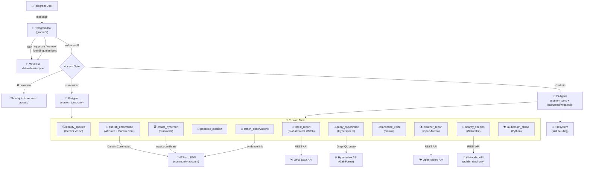

# Pi-Tainá 🌿

A self-hosted Telegram bot for community biodiversity documentation, powered by Pi agent

---

## What is Pi-Tainá?

Pi-Tainá is a community biodiversity AI assistant that lives on Telegram. It helps communities document and monitor local wildlife by:

- **Identifying species** from photos using vision AI
- **Coaching on photo quality** with organism-specific tips to get better observations
- **Publishing Darwin Core occurrence records** to a community ATProto/Bluesky account as permanent, open data
- **Forest health reports** — tree cover loss, fire alerts, and deforestation alerts for any location, powered by Global Forest Watch
- **Hypercerts** — create impact certificates for conservation projects and link observations as verifiable evidence
- **Browse the network** — search and browse community biodiversity records and hypercerts on the Hypersphere
- **Answering questions** about local ecology, conservation, and biodiversity

Each community runs their own instance with their own personality, language, and local knowledge. Built on the Pi coding agent — communities can ask Tainá to build new capabilities for them.

Pi-Tainá is part of the [GainForest](https://gainforest.earth) network.

---

## Raspberry Pi Deployment

Pi-Tainá runs great on a Raspberry Pi as an always-on community server.

### Hardware Requirements

| Device | Status | Notes |
|---|---|---|
| Raspberry Pi 4 or 5 | ✅ Recommended | Best performance |
| Raspberry Pi 3B+ or Zero 2 W | ⚠️ Works | Needs swap — see below |

- **RAM:** 2GB recommended; 1GB works with swap enabled
- **Storage:** 16GB microSD minimum; 32GB recommended
- **Network:** Stable internet connection required

### OS Requirement — Important

You **must** use **64-bit Raspberry Pi OS** (arm64/aarch64).

32-bit Raspberry Pi OS will **not** work — native dependencies (`koffi`, `esbuild`, `clipboard`) only ship prebuilt binaries for `linux_arm64`.

Download the 64-bit image: [raspberrypi.com/software](https://www.raspberrypi.com/software/)

To check your architecture:
```bash
uname -m   # should show: aarch64
```

If it shows `armv7l`, you're on 32-bit OS — you'll need to re-flash with the 64-bit image.

### Swap Setup for 1GB Pis

If your Pi has only 1GB RAM, increase swap to prevent out-of-memory errors during `npm install`:

```bash
sudo dphys-swapfile swapoff
sudo nano /etc/dphys-swapfile   # set CONF_SWAPSIZE=2048
sudo dphys-swapfile setup && sudo dphys-swapfile swapon
```

This gives you 2GB of swap space, which is enough to install all dependencies without crashing.

---

## Quick Start

**Prerequisites:** Node.js 20+, npm, Python 3 (for AudioMoth chime generation)

> New here? Start with the short install guide: [INSTALL.md](INSTALL.md)

> **Fastest way:** Run `./setup.sh` — it installs everything automatically on macOS and Raspberry Pi.

1. Clone and setup:
   ```bash
   git clone https://github.com/gainforest/pi-taina.git
   cd pi-taina
   ./setup.sh
   ```
   The setup script installs Node.js, Python 3, and npm dependencies automatically.
   It also creates `.env` from the template if it doesn't exist.

2. Verify the installation:
   ```bash
   npm run test:install
   ```

3. Copy the example environment file and fill in your values:
   ```bash
   cp .env.example .env
   ```

4. Start the bot:
   ```bash
   npm start        # production
   npm run dev      # with hot-reload (watch mode)
   ```

5. Run the smoke test:
   ```bash
   npm run test:smoke
   ```

---

## Configuration

Copy `.env.example` to `.env` and set the following variables:

| Variable | Required | Description |
|---|---|---|
| `TELEGRAM_BOT_TOKEN` | Yes | From @BotFather on Telegram |
| `GEMINI_API_KEY` | Yes | Google Gemini API key (used for agent and species ID). Get from [aistudio.google.com](https://aistudio.google.com/apikey) |
| `ADMIN_USER_ID` | Yes | Telegram user ID of the bot admin. Get yours from [@userinfobot](https://t.me/userinfobot) |
| `ATPROTO_HANDLE` | For publishing | Community ATProto/Bluesky handle (e.g. `taina-amazon.bsky.social`) |
| `ATPROTO_PASSWORD` | For publishing | App password for the ATProto account (not your main password) |
| `ATPROTO_SERVICE` | No | ATProto service URL (default: `https://bsky.social`). Change if your community runs its own PDS |
| `ANTHROPIC_API_KEY` | No | Enables Claude models as an alternative provider |
| `OPENAI_API_KEY` | No | Enables GPT models as an alternative provider |
| `PI_MODEL` | No | Override the default conversational model (format: `provider/model-id`, e.g. `google/gemini-2.5-flash`) |
| `SPECIES_ID_MODEL` | No | Override the model used for species identification. Must be a Gemini model ID (e.g. `gemini-2.5-flash`) |
| `PI_CODING_AGENT_DIR` | No | Override Pi config directory (default: `~/.pi/agent`) |
| `PI_CACHE_RETENTION` | No | Set to `long` for extended prompt cache retention |
| `PI_SKIP_VERSION_CHECK` | No | Set to `1` to skip Pi version check at startup |
| `GFW_DATA_API_KEY` | No | Global Forest Watch Data API key for forest monitoring features. Get free at [data-api.globalforestwatch.org](https://data-api.globalforestwatch.org) |
| `iNaturalist_API_KEY` | No | iNaturalist API token for species enrichment and higher rate limits. Get from [inaturalist.org/users/api_token](https://www.inaturalist.org/users/api_token). Read-only — write access requires OAuth2 (see PARTNER-153) |

> **Minimum to boot:** You only need `TELEGRAM_BOT_TOKEN`, `GEMINI_API_KEY`, and `ADMIN_USER_ID`. All other features degrade gracefully with console warnings.

---

## Setting Up a Telegram Bot

1. Open Telegram and message [@BotFather](https://t.me/BotFather)
2. Send `/newbot` and follow the prompts to choose a name and username
3. Copy the bot token BotFather gives you
4. Paste it as `TELEGRAM_BOT_TOKEN` in your `.env` file
5. Optional: use `/setdescription` and `/setuserpic` in BotFather to give your bot a description and profile photo

---

## Setting Up an ATProto Account

ATProto (Bluesky) is used to publish permanent, open biodiversity occurrence records.

1. Create a Bluesky account for your community (e.g. `taina-amazon.bsky.social`)
2. Go to **Settings → App Passwords → Add App Password**
3. Give it a name (e.g. `pi-taina`) and copy the generated password
4. Set `ATPROTO_HANDLE` to your community handle and `ATPROTO_PASSWORD` to the app password in your `.env`

> **Note:** Use an app password, not your main account password. App passwords can be revoked independently.

---

## Setting Up Global Forest Watch

GFW enables forest health reports with tree cover loss charts, fire alerts, and deforestation alerts for any location.

1. Get a free API key at [data-api.globalforestwatch.org](https://data-api.globalforestwatch.org)
2. Set `GFW_DATA_API_KEY` in your `.env`

---

## Access Control

Tainá uses a local whitelist to control who can interact with the bot. No external database needed.

### Setup

1. Get your Telegram user ID (message [@userinfobot](https://t.me/userinfobot) on Telegram)
2. Add it to your `.env`:
   ```
   ADMIN_USER_ID=123456789
   ```
3. Start the bot — you're automatically the admin

### Managing Members

From Telegram, admins can use these commands:

| Command | Description |
|---------|-------------|
| `/join` | Anyone can request to join |
| `/approve <id>` | Approve a pending request or add a user directly |
| `/remove <id>` | Remove a member (can't remove admins) |
| `/pending` | View pending join requests |
| `/members` | View all community members |

### How It Works

- The whitelist is stored locally in `data/whitelist.json`
- Admin users get full access including filesystem tools for skill building
- Regular members can use all biodiversity tools but cannot access the filesystem
- Unknown users are blocked and prompted to `/join`

---

## Skills

Skills are documents that teach Tainá how to use each tool. They live in `skills/` and are referenced by the agent at runtime. Each skill is self-contained and can be edited to customize behavior.

| Skill | Description |
|---|---|
| `species-identification/` | How to identify species from photos with Gemini vision + iNaturalist enrichment |
| `publish-observation/` | How to publish a Darwin Core occurrence record to ATProto |
| `forest-monitoring/` | How to generate forest health reports from GFW data |
| `geocoding/` | How to convert place names to GPS coordinates |
| `hyperindex/` | How to query the Hypersphere network for records and hypercerts |
| `hypercerts/` | How to create hypercerts and attach observations as evidence |
| `audiomoth-chime/` | How to generate AudioMoth configuration chimes |
| `nearby-species/` | How to search for species near a location using iNaturalist |
| `weather/` | How to provide weather forecasts via Open-Meteo |
| `organization-setup/` | How to create community organizations, including Telegram Web App polygon capture and a pasted fallback if the automatic handoff doesn't arrive |

Tainá can also **build new skills on demand** — if a community member asks for something Tainá can't do yet, she can write and save a new skill in the `./skills/` directory.

---

## Organization Setup

Organization creation is conversation-first.

- If a community wants to define a territory, land, site boundary, or area, Tainá offers a Telegram Web App button first so they can draw the polygon directly.
- The bot asks for one action only: tap the button and draw the area.
- When Telegram sends the drawn boundary back automatically, Tainá continues the setup naturally and uses it in the organization record.
- If the automatic handoff doesn't arrive and someone pastes the fallback boundary data from the Web App into chat, Tainá accepts it, confirms the boundary was recovered, and keeps going without asking them to redraw unless the data is invalid.
- Point-only organization creation still remains supported.

This keeps the flow native to Telegram without asking people to paste technical payloads into chat.

---

## Bumicerts (Hypercerts)

Bumicerts (also known as hypercerts) are impact certificates that let communities document conservation and reforestation work as verifiable, on-chain records.

**What you can do:**
- Create a hypercert for a project or initiative (with title, description, location, dates, work scope)
- Attach community biodiversity observations as evidence to back up the claim
- Browse existing hypercerts on the Hypersphere network

Tainá handles the hypercert creation wizard proactively, asking for missing fields like contributor names and location before publishing.

---

## Customizing for Your Community

Pi-Tainá is designed to be adapted for each community:

- **Edit `AGENTS.md`** to customize Tainá's personality, language, local species knowledge, and behavior
- **Add skills** in the `./skills/` directory — each skill is a file that extends what Tainá can do
- **Ask Tainá to build skills herself** — she can write and save new capabilities when community members request them

Examples of customizations:
- Change the language Tainá responds in by default
- Add local species names and traditional ecological knowledge
- Create skills for specific workflows your community needs

---

## How It Works

### Architecture



### Message Flow

1. User sends a message on Telegram (text, photo, voice, or location)
2. Bot checks if user is in the local whitelist (`data/whitelist.json`)
3. Unknown users are blocked — they can send `/join` to request access
4. Authorized users' messages go to the Pi agent with their role (admin or member)
5. The agent picks the right tool based on the message:
   - 📸 Photo → species identification → offer to publish
   - 🎤 Voice → transcription → treated as text
   - 📍 Location → forest health report with chart
   - 💬 Text → conversation, queries, bumicert creation, etc.
6. Results are sent back as HTML-formatted Telegram messages

### Deployment Model

Each community runs their own instance of Tainá:

```
Community A (Amazon)          Community B (Nairobi)
┌─────────────────────┐      ┌─────────────────────┐
│ @taina_amazon_bot   │      │ @taina_nairobi_bot  │
│ Mac Mini / RPi      │      │ Mac Mini / RPi      │
│ .env (own keys)     │      │ .env (own keys)     │
│ data/whitelist.json │      │ data/whitelist.json │
│ ATProto: amazon.bsky│      │ ATProto: nairobi.bsk│
└─────────────────────┘      └─────────────────────┘
         │                            │
         └──────────┬─────────────────┘
                    ▼
          🌐 Hypersphere Network
          (shared, open data layer)
```

- **Local-first**: each community owns their bot, data, and whitelist
- **No shared cloud**: no database, no auth service, no central server
- **Connected via Hypersphere**: all communities' records are queryable across the network
- **Self-extensible**: admin users can ask Tainá to build new skills

---

## Running as a Service

### Raspberry Pi (systemd)

The setup script can install Tainá as a systemd service automatically. If you skipped that step:

1. Copy the service file:
   ```bash
   sudo cp taina.service /etc/systemd/system/
   sudo systemctl daemon-reload
   sudo systemctl enable taina
   ```

2. Start and manage:
   ```bash
   sudo systemctl start taina     # Start the bot
   sudo systemctl status taina    # Check status
   journalctl -u taina -f         # View logs
   sudo systemctl restart taina   # Restart
   ```

### Mac Mini (pm2)

For always-on deployment on a Mac Mini, use [pm2](https://pm2.keymetrics.io/):

1. Install pm2 globally:
   ```bash
   npm install -g pm2
   ```

2. Start Pi-Tainá with pm2:
   ```bash
   pm2 start npm --name taina -- start
   ```

3. Enable auto-restart on crash and auto-start on boot:
   ```bash
   pm2 startup
   pm2 save
   ```

4. Useful pm2 commands:
   ```bash
   pm2 status          # Check if taina is running
   pm2 logs taina      # View recent logs
   pm2 restart taina   # Restart the bot
   pm2 stop taina      # Stop the bot
   ```

---

## Project Structure

```
pi-taina/
├── src/
│   ├── index.ts              # Bot entry point, startup sequence
│   ├── agent.ts              # Pi agent session management and custom tools
│   ├── telegram.ts           # Telegram bot transport (grammY)
│   ├── atproto.ts            # ATProto community account client
│   ├── env.ts                # Environment variable loader
│   ├── hyperindex.ts         # Hyperindex GraphQL client (org context)
│   ├── whitelist.ts          # Local-first access control (JSON whitelist)
│   └── tools/
│       ├── identify-species.ts    # Species ID via Gemini vision + iNaturalist enrichment
│       ├── inaturalist-api.ts     # iNaturalist v1 API client (species search, nearby, conservation)
│       ├── publish-occurrence.ts  # Darwin Core → ATProto
│       ├── geocode-location.ts    # Place name → GPS coordinates
│       ├── gfw-api.ts             # GFW Data API (tree cover, fire, deforestation)
│       ├── gfw-chart.ts           # Tree cover loss chart image generator
│       ├── weather.ts             # Weather forecasts via Open-Meteo
│       ├── transcribe-voice.ts    # Voice note → text (Gemini)
│       ├── query-hyperindex.ts    # Search Hypersphere network
│       ├── create-hypercert.ts    # Create hypercert records
│       └── attach-observations.ts # Link observations to hypercerts
├── skills/                   # Agent skills (one subdirectory per skill)
│   ├── species-identification/
│   ├── publish-observation/
│   ├── forest-monitoring/
│   ├── geocoding/
│   ├── hyperindex/
│   ├── hypercerts/
│   ├── audiomoth-chime/
│   ├── nearby-species/
│   └── weather/
├── data/
│   ├── sessions/             # Per-user agent session state (gitignored)
│   └── whitelist.json        # Community member whitelist (gitignored)
├── .env.example              # Environment variable template
├── setup.sh                  # Cross-platform setup script (macOS + Raspberry Pi)
├── .nvmrc                    # Node.js version for nvm/fnm
└── package.json
```

---

## Troubleshooting

### npm install fails with 'Killed' or runs out of memory

**Cause:** Not enough RAM — common on 1GB Raspberry Pi models.
**Fix:** Add swap space before running `npm install`. See the [Swap Setup](#swap-setup-for-1gb-pis) section above.

---

### npm install fails with 'unsupported platform' or native module errors

**Cause:** You're running 32-bit Raspberry Pi OS. Native dependencies (`koffi`, `esbuild`, `clipboard`) only ship prebuilt binaries for 64-bit ARM.
**Fix:** Reflash with 64-bit Raspberry Pi OS. Check your architecture first:
```bash
uname -m   # must show: aarch64
```
If it shows `armv7l`, you need to re-flash. Download the 64-bit image at [raspberrypi.com/software](https://www.raspberrypi.com/software/).

---

### Bot starts but immediately crashes

**Cause:** Missing required environment variables.
**Fix:** Make sure `TELEGRAM_BOT_TOKEN`, `GEMINI_API_KEY`, and `ADMIN_USER_ID` are set in your `.env` file.
To check:
```bash
cat .env | grep -v '^#' | grep -v '^$'
```

---

### Bot can't connect to Telegram

**Cause:** No internet, DNS issues, or firewall blocking outbound connections.
**Fix:** Test connectivity:
```bash
ping api.telegram.org
```
If it fails, check your network connection or router/firewall settings.

---

### 'python3 not found' when generating AudioMoth chime

**Cause:** Python 3 is not installed.
**Fix:**
```bash
sudo apt-get install -y python3
```

---

### Permission denied on setup.sh

**Fix:**
```bash
chmod +x setup.sh
./setup.sh
```

---

### How to view logs

- **systemd:** `journalctl -u taina -f`
- **pm2:** `pm2 logs taina`
- **Running directly:** logs appear in the terminal

---

## License

MIT
